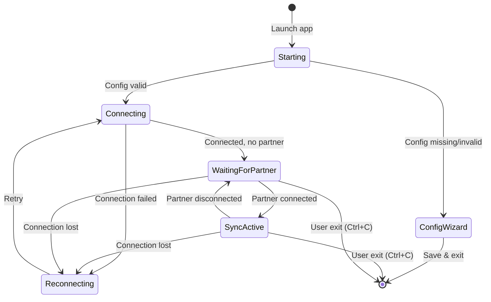
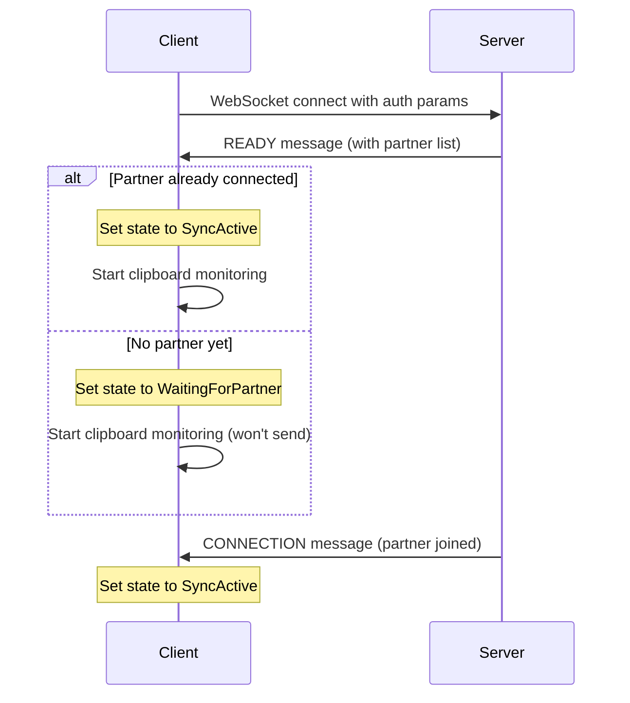
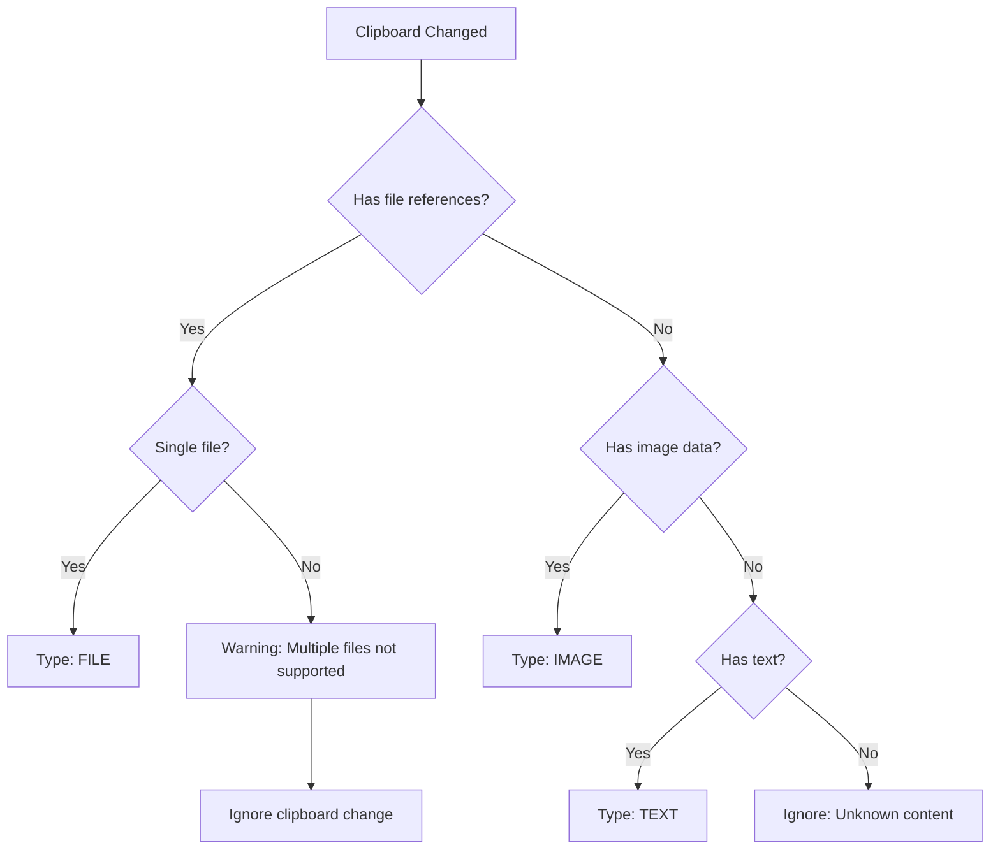

# WSClip - Clipboard Synchronization Client Specification

## 1. Overview

### 1.1 Purpose

A desktop application that synchronizes clipboard content between devices in real-time via WebSocket. When a user copies
content on one device, it automatically appears in the clipboard of connected devices.

### 1.2 Goal

The clipboard state on both machines should be **identical**. If user A copies something, user B should be able to paste
it exactly as if they had copied it themselves.

### 1.3 Supported Content Types

| Type      | Description                       | Example                                                            |
|-----------|-----------------------------------|--------------------------------------------------------------------|
| **TEXT**  | Plain text content                | Copy text from browser, editor, terminal                           |
| **IMAGE** | Image data in memory (not a file) | Screenshots (Win+Shift+S, PrtSc), "Copy image" from browser        |
| **FILE**  | Single file reference             | Copy a file from file explorer (any type: .jpg, .docx, .mp4, etc.) |

### 1.4 Not Supported (Show Warning)

- Multiple files selected
- Directories/folders
- Empty or unknown clipboard content

### 1.5 Content Size Limit

- **Maximum**: 20MB per clipboard content
- Rationale: Server limit is 100MB, base64 encoding adds ~33% overhead

---

## 2. User Experience

### 2.1 Application States



### 2.2 User Messages

The application must clearly communicate its state to the user:

**Startup:**
```
WSClip v1.0.0
Connecting to server...
Connected successfully
Waiting for partner device...
```

**Partner connects:**
```
Partner connected: device-abc
Clipboard sync is now active
```

**Partner disconnects:**
```
Partner disconnected: device-abc
Clipboard sync paused - waiting for partner...
```

**Sync events (normal mode):**
```
Sent: text (1.2 KB) [a1b2c3d4]
Received: text (567 bytes) [e5f6g7h8]
Sent ACK [e5f6g7h8]
Received ACK [a1b2c3d4]
Sent: image (245.3 KB) [i9j0k1l2]
Sent: file "document.pdf" (1.2 MB) [m3n4o5p6]
Received: file "report.xlsx" (890.5 KB) [q7r8s9t0]
```

Note: The ID shown in brackets is the last segment of the message UUID for traceability.

**Warnings:**
```
Warning: Multiple files not supported, clipboard change ignored
Warning: Directory copy not supported, clipboard change ignored
Warning: Content too large (25.4 MB), maximum is 20 MB
```

**Reconnection:**
```
Connection lost. Reconnecting in 2s... (attempt 2)
Connection lost. Reconnecting in 4s... (attempt 3)
Reconnected successfully
```

**Errors:**
```
Error: Authentication failed - check your configuration
Error: Session is full (maximum 2 devices)
```

**Shutdown:**
```
Shutting down...
Goodbye!
```

### 2.3 Exit Behavior

On Ctrl+C or termination signal:
1. Stop clipboard monitoring
2. Clean up any temporary files created by the application
3. Close WebSocket connection gracefully
4. Exit with code 0

On fatal error:
1. Display clear error message with guidance
2. Exit with non-zero code

---

## 3. Configuration

### 3.1 File Location (XDG Standard)

| Platform | Path                                       |
|----------|--------------------------------------------|
| Linux    | `~/.config/wsclip/config.json`             |
| Windows  | `%USERPROFILE%\.config\wsclip\config.json` |
| macOS    | `~/.config/wsclip/config.json`             |

### 3.2 Configuration Schema

```json
{
  "serverUrl": "wss://example.com:3000",
  "secret": "your-shared-secret",
  "sessionId": "ABC12345",
  "connectionId": "my-device",
  "maxContentSize": 20971520
}
```

| Field            | Required | Description                  | Validation                                 |
|------------------|----------|------------------------------|--------------------------------------------|
| `serverUrl`      | Yes      | WebSocket server URL         | Must start with `ws://` or `wss://`        |
| `secret`         | Yes      | Shared authentication secret | Non-empty string                           |
| `sessionId`      | Yes      | Session identifier           | Exactly 8 alphanumeric characters          |
| `connectionId`   | Yes      | Unique device identifier     | Non-empty string                           |
| `maxContentSize` | No       | Max content size in bytes    | Positive integer, default: 20971520 (20MB) |

### 3.3 Configuration Wizard

If configuration file doesn't exist or is incomplete, run interactive setup:

```
Welcome to WSClip!

No configuration found. Let's set up your sync client.

Server URL (e.g., wss://example.com:3000):
Shared secret:
Session ID (press Enter to generate):
Device name (press Enter for "DESKTOP-ABC"):

Configuration saved to ~/.config/wsclip/config.json
Please restart the application to begin syncing.
```

**Auto-generation rules:**

- `sessionId`: Generate random 8 alphanumeric characters if empty
- `connectionId`: Use system hostname if empty

### 3.4 Validation Errors

Display specific validation errors and exit:

```
Configuration error: serverUrl must start with ws:// or wss://
Configuration error: sessionId must be exactly 8 alphanumeric characters
Configuration error: secret cannot be empty
```

---

## 4. Connection Management

### 4.1 Connection Flow



### 4.2 Two Connection States

The application tracks two independent states:

1. **Server Connected**: WebSocket connection is open and authenticated
2. **Partner Connected**: At least one other device is in the session

**Critical Rule**: Only send clipboard content when BOTH states are true.

### 4.3 Auto-Reconnection

Use exponential backoff when connection is lost:

| Attempt | Delay            |
|---------|------------------|
| 1       | 1 second         |
| 2       | 2 seconds        |
| 3       | 4 seconds        |
| 4       | 8 seconds        |
| 5       | 16 seconds       |
| 6+      | 30 seconds (max) |

Reset delay to 1 second after successful connection.

### 4.4 Fatal Errors (Do Not Retry)

These errors require user intervention - exit the application:

- `INVALID_SECRET`: Wrong authentication secret
- `SESSION_FULL`: Session already has 2 devices
- `DUPLICATE_CONNECTION_ID`: Another device using same ID

---

## 5. Clipboard Monitoring

### 5.1 Detection Approaches

Choose based on platform capabilities (in order of preference):

1. **Native events** (best): Subscribe to OS clipboard change notifications
2. **Polling with sequence number**: Check clipboard change counter periodically
3. **Polling with content comparison**: Compare content hash periodically (fallback)

**Requirements:**
- Detect changes within 500ms maximum
- CPU usage below 5% average
- Handle clipboard locked by other applications gracefully

### 5.2 Content Type Detection

When clipboard changes, detect content type in this order:



**Important distinctions:**
- **IMAGE**: Raw image data in clipboard (screenshot, copied image from browser)
- **FILE**: Reference to a file on disk (copied from file explorer)

These are different! Copying a .jpg file from explorer is FILE, not IMAGE.

### 5.3 Preventing Infinite Loops

**Critical**: Track the last content applied to prevent echo loops.

```
When local clipboard changes:
    if content == lastAppliedContent:
        ignore (this is echo from sync)
    else:
        send to partner
        lastAppliedContent = content

When receiving content from partner:
    lastAppliedContent = receivedContent
    write to clipboard
```

**Why this matters:**
Without this check, Device A sends to B, B writes to clipboard, B detects change, B sends back to A, infinite loop.

**Comparison method:**
- For TEXT: Compare string content (or hash for large text)
- For IMAGE: Compare image hash (e.g., MD5 of PNG bytes)
- For FILE: Compare filename + size + modification time

---

## 6. Content Handling

### 6.1 TEXT Content

**Sending:**
1. Read text from clipboard
2. Check size against `maxContentSize` (raw UTF-8 bytes)
3. Send as DATA message with `contentType: "text"` and raw UTF-8 text in `data` field (NOT base64 encoded)

**Receiving:**
1. Extract text directly from `data` field (raw UTF-8, no decoding needed)
2. Write text to clipboard
3. Update `lastAppliedContent`

**Note:** TEXT content uses raw UTF-8 encoding in JSON, which natively supports all Unicode characters.

**Result:** User can Ctrl+V to paste text anywhere.

### 6.2 IMAGE Content

**Sending:**
1. Read image data from clipboard
2. Convert to PNG format
3. Encode as base64
4. Check size against `maxContentSize`
5. Send as DATA message with:
   - `contentType: "binary"`
   - `metadata.mimeType: "image/png"`
   - `metadata.size`: size in bytes

**Receiving:**
1. Decode base64 to PNG bytes
2. Write image data to clipboard (as image, not as file)
3. Update `lastAppliedContent`

**Result:** User can Ctrl+V to paste image directly in Paint, Word, etc.

### 6.3 FILE Content

**Sending:**
1. Read file reference from clipboard
2. Verify it's a single file (not multiple, not directory)
3. Read file content from disk
4. Encode as base64
5. Check size against `maxContentSize`
6. Send as DATA message with:
   - `contentType: "binary"`
   - `metadata.mimeType`: detected MIME type or "application/octet-stream"
   - `metadata.filename`: original filename

**Receiving:**
1. Decode base64 to file bytes
2. Save to temporary location (application-managed directory)
3. Write file reference to clipboard
4. Update `lastAppliedContent`

**Result:** User can Ctrl+V to paste the file in any folder.

### 6.4 Temporary File Management

Files received must be saved to disk before putting reference in clipboard.

**Storage location:** Application-managed temp directory (e.g., inside app data folder)

**Cleanup strategy:**
1. **On new file received**: Delete previously received file(s)
2. **On application exit**: Delete all temporary files

This prevents disk space accumulation.

### 6.5 Size Validation

Before sending any content:

```
if contentSize > maxContentSize:
    log warning with actual size and limit
    do not send
    return
```

Display human-readable sizes:

- Under 1 KB: "123 bytes"
- Under 1 MB: "45.6 KB"
- 1 MB and above: "12.3 MB"

---

## 7. Protocol Integration

The application communicates with the server using the CRSP (Content Relay Sync Protocol).

**Full protocol documentation:** See `SERVER_REFERENCE.md`

### 7.1 Messages the Client Sends

| Message | When                      | Purpose                 |
|---------|---------------------------|-------------------------|
| DATA    | Clipboard changes locally | Send content to partner |
| ACK     | After receiving DATA      | Confirm receipt         |

### 7.2 Messages the Client Receives

| Message    | Action                                |
|------------|---------------------------------------|
| READY      | Store partner list, set initial state |
| CONNECTION | Update partner connected state        |
| DATA       | Write content to clipboard, send ACK  |
| ACK        | Log receipt confirmation              |
| ERROR      | Log error, exit if fatal              |

### 7.3 ACK Handling

**When receiving DATA:**
1. Process the content and write to clipboard
2. Send ACK message with the original message ID
3. Log: `Sent ACK [shortId]`

**When receiving ACK:**
1. Log: `Received ACK [shortId]`

**Note:** The short ID is the last segment of the UUID (split by `-`) for compact logging while maintaining traceability.

---

## 8. Logging

### 8.1 Log Levels

| Level | Usage                                             |
|-------|---------------------------------------------------|
| ERROR | Fatal errors, authentication failures             |
| WARN  | Recoverable issues, timeouts, unsupported content |
| INFO  | Normal operations (default)                       |
| DEBUG | Detailed message flow (verbose mode)              |

### 8.2 Log Format

```
YYYY-MM-DD HH:MM:SS [LEVEL] Message
```

Examples:
```
2025-01-06 14:32:10 [INFO] Connected to wss://example.com:3000
2025-01-06 14:32:10 [INFO] Partner connected: device-xyz
2025-01-06 14:32:15 [INFO] Sent: text (1.2 KB) [a1b2c3d4]
2025-01-06 14:32:15 [INFO] Received ACK [a1b2c3d4]
2025-01-06 14:32:18 [INFO] Received: file "doc.pdf" (2.5 MB) [e5f6g7h8]
2025-01-06 14:32:18 [INFO] Sent ACK [e5f6g7h8]
2025-01-06 14:32:20 [DEBUG] Clipboard change detected: TEXT
```

### 8.3 Verbose Mode

When `--verbose` flag is used:
- Set log level to DEBUG
- Log all message transmissions
- Log clipboard monitoring activity
- Log state changes

---

## 9. Command Line Interface

### 9.1 Usage

```
wsclip [OPTIONS]

Options:
  --config <path>    Path to configuration file
                     Default: ~/.config/wsclip/config.json
  --verbose          Enable verbose logging
  --help, -h         Show help message and exit
```

### 9.2 Examples

```bash
# Normal usage (uses default config)
wsclip

# Custom config file
wsclip --config /path/to/config.json

# Verbose mode for debugging
wsclip --verbose
```

---

## 10. Error Handling Summary

| Scenario                    | Action                           |
|-----------------------------|----------------------------------|
| Config file not found       | Run configuration wizard         |
| Config validation fails     | Show specific errors, exit       |
| Cannot connect to server    | Retry with exponential backoff   |
| Authentication failed       | Show error, exit (no retry)      |
| Session full                | Show error, exit (no retry)      |
| Partner not connected       | Queue nothing, wait silently     |
| Clipboard read fails        | Log debug, continue monitoring   |
| Clipboard write fails       | Log warning, send ACK with error |
| Content too large           | Log warning, skip sending        |
| Multiple files in clipboard | Log warning, skip sending        |
| Directory in clipboard      | Log warning, skip sending        |
| ACK timeout                 | Log warning, continue            |
| WebSocket disconnected      | Retry with exponential backoff   |

---

## 11. Implementation Checklist

### Core Functionality

- [ ] Load and validate configuration from XDG path
- [ ] Run configuration wizard if config missing
- [ ] Connect to WebSocket server with authentication
- [ ] Handle READY message and set initial state
- [ ] Handle CONNECTION messages (partner status)
- [ ] Handle ERROR messages appropriately
- [ ] Implement auto-reconnection with exponential backoff

### Clipboard Monitoring

- [ ] Detect clipboard changes (TEXT, IMAGE, FILE)
- [ ] Prevent infinite sync loops with lastAppliedContent tracking
- [ ] Ignore multiple files with warning
- [ ] Ignore directories with warning
- [ ] Validate content size before sending

### Content Sync

- [ ] Send TEXT content
- [ ] Send IMAGE content (as PNG)
- [ ] Send FILE content (single file)
- [ ] Receive and apply TEXT to clipboard
- [ ] Receive and apply IMAGE to clipboard (as image data)
- [ ] Receive and apply FILE to clipboard (as file reference)

### File Management

- [ ] Save received files to temp directory
- [ ] Clean up previous file when new one received
- [ ] Clean up all temp files on exit

### User Experience

- [ ] Clear status messages for all states
- [ ] Human-readable sizes in logs
- [ ] Graceful shutdown on Ctrl+C
- [ ] Helpful error messages

### CLI

- [ ] `--config` option
- [ ] `--verbose` option
- [ ] `--help` option

---

## 12. Suggested Architecture

This section provides lightweight architectural guidance to maintain consistency across implementations.

### 12.1 Suggested Modules

Organize code into these logical modules:

| Module        | Purpose                                                   |
|---------------|-----------------------------------------------------------|
| **config**    | Load, validate, and save configuration; run setup wizard  |
| **websocket** | Manage WebSocket connection lifecycle and message routing |
| **clipboard** | Monitor changes, read content, write content              |
| **sync**      | Orchestrate synchronization logic, track applied content  |
| **protocol**  | Message types, creation, and parsing                      |
| **files**     | Manage temporary files for received FILE content          |
| **utils**     | Shared utilities: logging, base64, backoff calculator     |

### 12.2 Suggested Directory Structure

```
src/
├── main              # Entry point: CLI parsing, component wiring, lifecycle
├── config/
│   ├── loader        # Load/save JSON config file
│   ├── validator     # Validate config fields
│   └── wizard        # Interactive setup prompts
├── websocket/
│   ├── connection    # WebSocket lifecycle, reconnection logic
│   └── handler       # Route incoming messages by type
├── clipboard/
│   ├── monitor       # Detect clipboard changes
│   ├── reader        # Read clipboard content (TEXT, IMAGE, FILE)
│   └── writer        # Write content to clipboard
├── sync/
│   ├── service       # Orchestrate sync logic (main coordinator)
│   └── tracker       # Track lastAppliedContent to prevent loops
├── protocol/
│   ├── messages      # Message type definitions
│   ├── factory       # Create outgoing messages
│   └── parser        # Parse incoming messages
├── files/
│   └── manager       # Save received files, cleanup temp files
└── utils/            # Shared utilities
```

### 12.3 Key Components

| Component              | Responsibility                                             |
|------------------------|------------------------------------------------------------|
| **Sync Service**       | Main orchestrator - coordinates all other components       |
| **Connection Manager** | WebSocket lifecycle, auto-reconnect, send/receive messages |
| **Clipboard Monitor**  | Detect clipboard changes, notify Sync Service              |
| **Content Tracker**    | Track last applied content to prevent infinite loops       |
| **File Manager**       | Save received files, cleanup on new file or exit           |

### 12.4 Suggested Patterns

| Pattern                    | Where to Apply                     | Purpose                                      |
|----------------------------|------------------------------------|----------------------------------------------|
| **Observer/Event Emitter** | Clipboard Monitor → Sync Service   | Decouple clipboard detection from sync logic |
| **Strategy**               | Clipboard Reader/Writer            | Different implementations per content type   |
| **Factory**                | Message Factory                    | Create properly structured protocol messages |
| **Singleton**              | Config, Logger, Connection Manager | Single instance shared across components     |
| **State Machine**          | Connection Manager                 | Manage connection states and transitions     |

