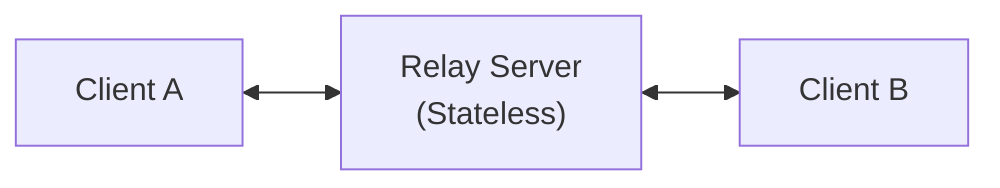

# CRSP Protocol Specification

Content Relay Sync Protocol (CRSP). A structured WebSocket protocol for peer-to-peer content synchronization through a
stateless relay server.

---

## 1. Overview

### 1.1 Purpose

CRSP (Content Relay Sync Protocol) is a WebSocket-based protocol designed for content synchronization between devices
through a stateless relay server. The protocol provides the minimal structure necessary for heterogeneous clients to
reliably exchange content while maintaining flexibility for specific implementation needs.

### 1.2 Target Use Cases

- Clipboard synchronization between devices
- Peer-to-peer file transfer with relay mediation
- Binary or text content exchange
- Any content exchange scenario requiring relay

### 1.3 Design Principles

1. **Stateless Relay**: Server does not maintain application state, only facilitates communication
2. **Minimal Validation**: Server validates critical structure, client validates semantics
3. **Controlled Extensibility**: Strict core fields, flexible extension areas
4. **Transparency**: Server relays without modifying client payload
5. **Simplicity**: Only essentials, avoid overengineering

---

## 2. Architecture

### 2.1 Communication Model



**Characteristics**:

- Private session with exactly 2 participants
- Bidirectional symmetric communication
- Transparent relay server (does not modify data messages)
- No message persistence

### 2.2 Message Categories

The protocol defines three main categories:

1. **Control Messages**: Connection management
2. **Data Messages**: Content exchange between clients
3. **System Messages**: Server notifications

---

## 3. Message Structure

### 3.1 Base Format

All CRSP messages follow this hierarchical structure:

```typescript
{
  "header": {
    // Protocol information - STRICT VALIDATION
  },
  "payload": {
    // Message content - FLEXIBLE VALIDATION
  }
}
```

### 3.2 Header Structure (Required)

The header contains protocol metadata and is subject to strict validation:

```typescript
interface MessageHeader {
  type: MessageType;    // REQUIRED - Message type
  id: string;           // REQUIRED - Unique UUID v4
  timestamp: string;    // REQUIRED - ISO 8601 timestamp
}

type MessageType =
        // Control Messages (client <-> client via relay)
        | "control"           // Generic control command

        // Data Messages (client <-> client via relay)
        | "data"              // Data message
        | "ack"               // Reception acknowledgment

        // System Messages (server -> client)
        | "ready"             // Connection confirmation
        | "connection"        // Connection event (joined/left)
        | "error";            // Server error
```

**Header Validation Rules**:

- All fields are required
- `type`: Must be a valid MessageType enum value
- `id`: Must be valid UUID v4
- `timestamp`: Must be valid ISO 8601
- No additional fields are permitted in the header

### 3.3 Payload Structure (Variable)

The payload contains message-specific content. Structure varies by message type and has flexible validation.

---

## 4. Message Specifications

### 4.1 Control Messages

#### 4.1.1 CONTROL Message (Client to Client)

**Purpose**: Generic and extensible control message for commands between clients.

**Structure**:

```json
{
  "header": {
    "type": "control",
    "id": "a1b2c3d4-e5f6-7890-abcd-ef1234567890",
    "timestamp": "2025-12-24T10:35:00.000Z"
  },
  "payload": {
    "command": "sync_request",
    "metadata": {
      "full": true,
      "since": "2025-12-24T10:00:00.000Z"
    }
  }
}
```

**Payload Fields**:

- `command` (string): REQUIRED - Command identifier
- `metadata` (object | null): OPTIONAL - Flexible parameters for the command

**Validation**:

- Header: Strict validation
- Payload: Only validates `command` exists as string
- `metadata`: Complete passthrough - server does not validate content

**Server Behavior**:

- Validates basic structure
- Relays to other connection without modifications
- If no other connection: Returns error `NO_OTHER_CONNECTION`

---

### 4.2 Data Messages

#### 4.2.1 DATA Message (Client to Client)

**Purpose**: Transmit content (text or binary) between clients.

**Structure**:

```json
{
  "header": {
    "type": "data",
    "id": "f47ac10b-58cc-4372-a567-0e02b2c3d479",
    "timestamp": "2025-12-24T10:33:00.123Z"
  },
  "payload": {
    "contentType": "text",
    "data": "Hello World!",
    "metadata": {
      "mimeType": "text/plain",
      "size": 12,
      "encoding": "utf-8"
    }
  }
}
```

**Payload Fields**:

- `contentType` (enum): REQUIRED
  - `"text"`: Plain text content (UTF-8)
  - `"binary"`: Binary content encoded in Base64

- `data` (string): REQUIRED
  - For `"text"`: Direct UTF-8 string
  - For `"binary"`: Valid Base64 string

- `metadata` (object): OPTIONAL - Flexible object to describe content

**Suggested Metadata Fields** (non-exhaustive, clients can define custom):

- `mimeType`: MIME type (e.g., "text/plain", "image/png")
- `size`: Original content size in bytes
- `filename`: Filename (if applicable)
- `encoding`: Encoding (e.g., "utf-8", "base64")
- `compressed`: Indicates if data is compressed
- `compressionAlgorithm`: Compression algorithm (e.g., "gzip")
- `hash`: Content hash (e.g., SHA-256)

**Validation**:

- Header: Strict validation
- Payload:
  - `contentType`: Strict validation (must be "text" or "binary")
  - `data`: Strict validation
    - If `contentType: "text"`: Must be valid string
    - If `contentType: "binary"`: Must be valid Base64
  - `metadata`: Complete passthrough - server does not validate internal content
- Total JSON message size: Must not exceed `MAX_MESSAGE_SIZE` (implementation-specific limit)

**Server Behavior**:

- Validates structure per above rules
- Relays to other connection without modifying `payload`
- If no other connection: Returns error `NO_OTHER_CONNECTION`
- If size exceeds limit: Returns error `MESSAGE_TOO_LARGE`

#### 4.2.2 ACK Message (Client <-> Client)

**Purpose**: Confirm successful reception of a `data` or `control` message.

**Structure**:
```json
{
  "header": {
    "type": "ack",
    "id": "new-uuid-for-ack",
    "timestamp": "2025-12-24T10:33:01.234Z"
  },
  "payload": {
    "messageId": "f47ac10b-58cc-4372-a567-0e02b2c3d479",
    "status": "success",
    "metadata": {
      "receivedSize": 45678,
      "processingTime": 120
    }
  }
}
```

**Payload Fields**:

- `messageId` (string): REQUIRED - UUID of the message being acknowledged
- `status` (enum): REQUIRED
  - `"success"`: Message received and processed correctly
  - `"error"`: Error processing the message
- `metadata` (object | null): OPTIONAL - Additional flexible information

**Suggested Metadata Fields** (non-exhaustive, clients can define custom):

- `receivedSize`: Bytes received
- `errorCode?`: Error code (if status="error")
- `errorMessage`: Error message
- `processingTime`: Processing time in ms

**Validation**:

- Header: Strict validation
- Payload:
  - `messageId`: Strict validation (must be valid UUID)
  - `status`: Strict validation (must be "success" or "error")
  - `metadata`: Complete passthrough

**Server Behavior**:

- Validates basic structure
- Relays to other connection without modifications
- If no other connection: Ignores silently (ACK may arrive after disconnection)

---

### 4.3 System Messages

System messages are sent only by the server to clients. They do not have a flexible payload since they are
server-generated.

#### 4.3.1 READY Message (Server -> Client)

**Purpose**: Confirm successful authentication and provide session state including other connection information.

**Structure**:

```json
{
  "header": {
    "type": "ready",
    "id": "server-gen-uuid",
    "timestamp": "2025-12-24T10:30:00.000Z"
  },
  "payload": {
    "sessionId": "abc12345",
    "connectionId": "laptop-work",
    "otherConnection": {
      "id": "laptop-home",
      "address": "192.168.10.1",
      "connectedAt": "2025-12-24T10:30:00.000Z"
    }
  }
}
```

**Payload Fields**:
- `connectionId` (string): REQUIRED - Connected connection identifier
- `sessionId` (string): REQUIRED - Session ID (8 alphanumeric characters)
- `otherConnection` (object | null): REQUIRED - Existing connection information or null if no other connection

#### 4.3.2 CONNECTION Message (Server -> Client)

**Purpose**: Notify events related to other connections (joining or leaving the session).

**Structure**:
```json
{
  "header": {
    "type": "connection",
    "id": "server-gen-uuid",
    "timestamp": "2025-12-24T10:31:00.000Z"
  },
  "payload": {
    "connectionId": "phone-android",
    "event": "joined"
  }
}
```

**Payload Fields**:

- `connectionId` (string): REQUIRED - Connection identifier
- `event` (enum): REQUIRED
  - `"joined"`: Connection joined the session
  - `"left"`: Connection left the session
- `metadata` (object): OPTIONAL - Event-specific information

**Note**: When the second connection joins, only the first connection receives a `connection` message with `event: "joined"`. The
second connection receives the first connection's information in the `ready` message.

#### 4.3.3 ERROR Message (Server -> Client)

**Purpose**: Notify validation or state errors.

**Structure**:
```json
{
  "header": {
    "type": "error",
    "id": "server-gen-uuid",
    "timestamp": "2025-12-24T10:32:00.000Z"
  },
  "payload": {
    "code": "MESSAGE_TOO_LARGE",
    "message": "Message size 110000000 exceeds maximum 104857600 bytes",
    "messageId": "f47ac10b-58cc-4372-a567-0e02b2c3d479",
    "details": {
      "maxSize": 104857600,
      "actualSize": 110000000
    }
  }
}
```

**Payload Fields**:

- `code` (ErrorCode): REQUIRED - Error code
- `message` (string): REQUIRED - Descriptive message
- `messageId` (string | null): OPTIONAL - ID of message that caused the error
- `details` (object | null): OPTIONAL - Additional information

**Error Codes**:

The protocol defines categorized error codes to distinguish between different error types. Specific numeric values are
implementation-specific, but the categories are defined by the protocol:

**Message Errors** (recoverable after authentication):

- `INVALID_MESSAGE`: Invalid message format or structure
- `MESSAGE_TOO_LARGE`: Message exceeds configured size limit
- `NO_OTHER_CONNECTION`: No other connection available to receive the message

**Authentication Errors** (always fatal):

- `INVALID_SECRET`: Invalid authentication secret
- `INVALID_SESSION_ID`: Invalid session identifier
- `INVALID_CONNECTION_ID`: Invalid connection identifier

**State/Limit Errors** (always fatal):

- `SESSION_FULL`: Session has reached maximum connection limit
- `DUPLICATE_CONNECTION_ID`: Connection identifier already in use in session
- `RATE_LIMIT_EXCEEDED`: Connection rate limit exceeded
- `MAX_SESSIONS_REACHED`: Server session limit reached

**Internal Errors** (always fatal):

- `INTERNAL_ERROR`: Unexpected server error

**Closing Behavior**:

- Message errors: Recoverable - connection remains open, a client can retry
- Authentication, state/limit, and internal errors: Fatal - server closes connection after sending error message

---

## 5. Communication Flow

### 5.1 Connection Establishment

```
1. Client -> Server: WebSocket Upgrade
   URL: ws://host:port/ws?sessionId=abc12345&connectionId=laptop&secret=your-secret
   Headers: Authorization: Bearer your-secret (preferred method)

   Note: Either Authorization header or secret query parameter is required.
   Query parameter fallback is provided for browser WebSocket clients.

   Authentication is validated during HTTP handshake. If invalid:
   - HTTP 400 (INVALID_SESSION_ID, INVALID_CONNECTION_ID, INVALID_MESSAGE)
   - HTTP 401 (INVALID_SECRET)
   - HTTP 409 (DUPLICATE_CONNECTION_ID)
   - HTTP 429 (RATE_LIMIT_EXCEEDED)
   - HTTP 503 (SESSION_FULL, MAX_SESSIONS_REACHED)

2. Server: 101 Switching Protocols (WebSocket connection established)

3. Server -> Client: READY message (sent immediately upon connection)
   {
     "header": { "type": "ready", ... },
     "payload": { "otherConnection": null, ... }
   }
```

### 5.2 Second Client Joins

```
4. Client B -> Server: WebSocket Upgrade (same process as Client A)

5. Server -> Client B: READY message (includes existing connection info)
   {
     "header": { "type": "ready", ... },
     "payload": { "otherConnection": { "id": "laptop", ... }, ... }
   }

6. Server -> Client A: CONNECTION message
   {
     "header": { "type": "connection", ... },
     "payload": { "connectionId": "phone", "event": "joined", ... }
   }
```

### 5.3 Data Exchange with ACK

```
8. Client A -> Server: DATA message
   {
     "header": { "type": "data", "id": "msg-123", ... },
     "payload": { "contentType": "text", "data": "Hello", ... }
   }

9. Server -> Client B: (Relays DATA message without modifications)

10. Client B -> Server: ACK message
    {
      "header": { "type": "ack", "id": "ack-456", ... },
      "payload": { "messageId": "msg-123", "status": "success", ... }
    }

11. Server -> Client A: (Relays ACK message)
```

### 5.4 Control Command

```
12. Client A -> Server: CONTROL message
    {
      "header": { "type": "control", "id": "ctrl-789", ... },
      "payload": { "command": "ping", "metadata": null }
    }

13. Server -> Client B: (Relays CONTROL message)

14. Client B -> Server: CONTROL message (response)
    {
      "header": { "type": "control", "id": "ctrl-790", ... },
      "payload": { "command": "pong", "metadata": { "latency": 45 } }
    }

15. Server -> Client A: (Relays response)
```

### 5.5 Disconnection

```
16. Client B: Closes WebSocket connection

17. Server -> Client A: CONNECTION message
    {
      "header": { "type": "connection", ... },
      "payload": { "connectionId": "phone", "event": "left", ... }
    }
```

---

## 6. Validation and Server Rules

### 6.1 Validation Strategy by Layer

The server implements validation at three levels:

#### Level 1: Header (STRICT)
- All header fields are required
- Types must match specification exactly
- No additional fields permitted in header
- Any violation results in `INVALID_MESSAGE` error

#### Level 2: Payload Structure (SEMI-STRICT)
- Core fields defined by protocol are validated
- Types and values must match specification
- Example: `contentType` in DATA must be "text" or "binary"

#### Level 3: Extensible Payload (PASSTHROUGH)
- Objects marked as "flexible" (metadata) are not validated
- Server relays them as-is without inspecting content
- Client responsibility to validate semantics

### 6.2 Validation Table by Message Type

| Type            | Header | Main Payload                        | Extensible Payload       |
|-----------------|--------|-------------------------------------|--------------------------|
| `control`       | Strict | Semi-strict (`command`)             | Passthrough (`metadata`) |
| `data`          | Strict | Semi-strict (`contentType`, `data`) | Passthrough (`metadata`) |
| `ack`           | Strict | Semi-strict (`messageId`, `status`) | Passthrough (`metadata`) |
| System messages | Strict | Strict (server-generated)           | Passthrough (optional)   |

### 6.3 Unknown Fields Handling

```typescript
// At message root level
{
  "header": { ... },      // Only defined fields
  "payload": { ... },     // Only defined + extensible fields
  "unknownField": "..."   // IGNORED (does not cause error, discarded)
}

// Within extensible areas
{
  "payload": {
    "metadata": {
      "mimeType": "text/plain",     // Known field
      "customField": "value",        // ALLOWED (passthrough)
      "clientSpecific": { ... }      // ALLOWED (passthrough)
    }
  }
}
```

### 6.4 Protocol Constraints

The protocol defines the following constraints that implementations must respect:

| Constraint                | Value | Description                                        |
|---------------------------|-------|----------------------------------------------------|
| `CONNECTIONS_PER_SESSION` | 2     | Maximum connections per session (protocol-defined) |

**Implementation-Specific Limits**:

Implementations may define additional configurable limits such as:
- `MAX_MESSAGE_SIZE`: Maximum JSON message size
- `MAX_SESSIONS`: Maximum active sessions per server
- `IDLE_TIMEOUT`: Inactivity timeout for connections
- `RATE_LIMIT_MAX`: Connection rate limiting per IP
- `RATE_LIMIT_WINDOW`: Time window for rate limiting

See implementation documentation for specific default values and configuration options.

---

## 7. Implementation Considerations

### 7.1 Server Responsibilities

**Server MUST**:
- Validate message structure per defined level
- Verify authentication and authorization
- Manage sessions and connections
- Relay messages between connections
- Handle errors and notify clients
- Implement rate limiting and abuse protection
- Respect size and connection limits

**Server MUST NOT**:
- Modify payload content in data/control messages
- Interpret semantics of metadata fields
- Implement compression, encryption, or data transformation
- Maintain application synchronization state
- Persist messages (real-time relay only)
- Process or validate extensible field content

### 7.2 Client Responsibilities

**Client MUST**:
- Generate unique IDs (UUID v4) for each message
- Implement retry and reconnection logic
- Validate semantics of received messages
- Handle compression/decompression if using metadata.compressed
- Implement timeout for ACKs if requiring confirmations
- Respect message size limit before sending

**Client MAY**:
- Implement deduplication using message.id
- Compress data before sending (indicate in metadata)
- Calculate content hash for verification
- Define custom fields in extensible areas
- Ignore ACKs if confirmations not required
- Implement custom control commands

### 7.3 Protocol Guarantees

**WebSocket/TCP guarantees**:
- Ordered message delivery
- No message duplication
- Broken connection detection

**CRSP guarantees**:
- Consistent message structure
- Unique message identification (via ID)
- Transparent relay of extensible payloads
- Session event notification (join/leave)

**CRSP does NOT guarantee**:
- Message delivery (if other connection disconnected)
- Message persistence
- Reception confirmation (depends on optional ACKs)
- Order between different sessions
